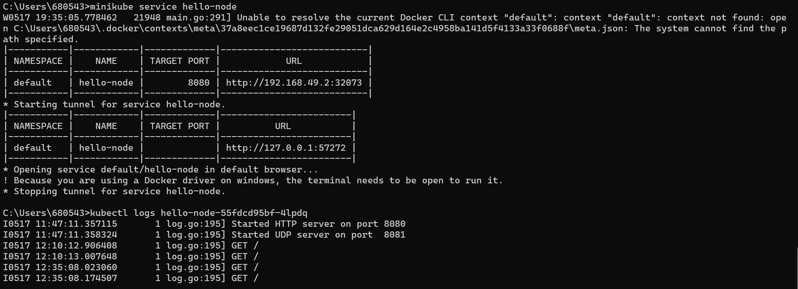

# **Rust Tutorial & Exercise**
**Muhammad Hilal Darul Fauzan** 
**2206830542** 
**Pemrograman Lanjut C** 

## **Tutorial Modul 11: Deployment & Monitoring**

1. **Compare the application logs before and after you exposed it as a Service. Try to open the app several times while the proxy into the Service is running. What do you see in the logs? Does the number of logs increase each time you open the app?**

    Ya, terdapat perbedaan setelah service di-expose karena service tersebut dapat menerima request. Ketika saya melakukan refresh berkali-kali terhadap service hello-node, log akan mencatat semua request yang diterima. Misalnya, log mungkin akan menunjukkan entri seperti ini setiap kali ada permintaan baru:

    

2. **Notice that there are two versions of `kubectl get` invocation during this tutorial section. The first does not have any option, while the latter has `-n` option with value set to `kube-system`. What is the purpose of the `-n` option and why did the output not list the pods/services that you explicitly created?**

    Namespace dalam Kubernetes adalah mekanisme untuk mengisolasi grup resource tertentu dalam satu cluster. Namespace dibuat ketika pengguna terpisah menjadi beberapa tim atau proyek.

    Ada dua versi command `kubectl get`:
    - Tanpa `-n`: Perintah ini mengambil informasi dari namespace default, yaitu dari namespace tempat saya bekerja dalam cluster Kubernetes.
    - Dengan `-n`: `n` adalah singkatan dari namespace. Perintah ini mengambil informasi dari namespace tertentu saja. Pada tutorial ini, informasi diambil hanya dari namespace `kube-system`.

    Output dari command tidak menyebutkan pods/service yang telah saya buat karena mereka berada dalam namespace `default`, bukan `kube-system`.